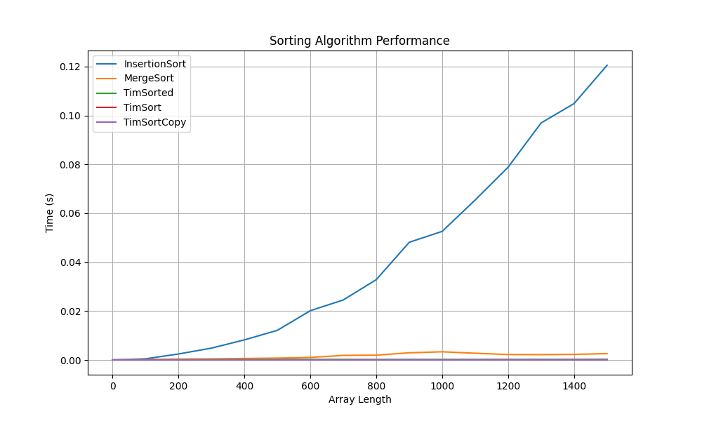
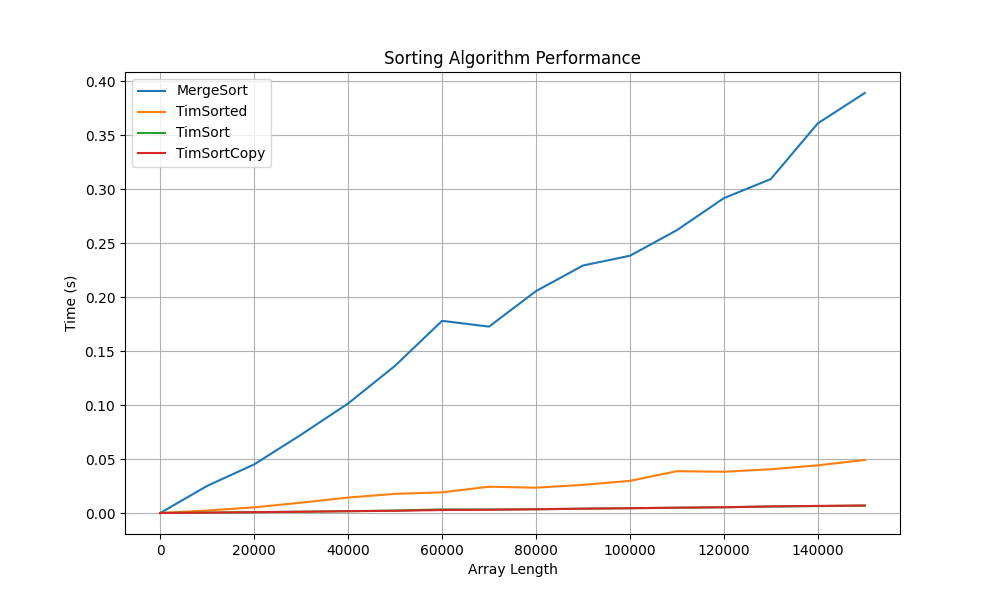

# GoITNeo Algo HW-4

## Task
Compare three sorting algorithms: Insertion Sort, Merge Sort and Timsort based on their execution time. The analysis should be supported by empirical data obtained through testing the algorithms on different datasets. Empirically verify the theoretical complexity estimates of the algorithms, such as sorting on large arrays. Use the ```timeit``` module to measure the execution time of the algorithms.

## What we test
Let's compare next function:
 - ```InsertionSort``` - does not change an input data
 - ```MergeSort``` - does not change an input data
 - ```TimSorted``` - standard python function ```sorted()```, does not change an input data
 - ```TimSort``` - standard python list's method ```sort()```, DOES change an input data
 - ```TimSortCopy``` - standard python list's method ```sort()```, with copy an input data and applying ```sort()```

## How we test
1. Generate a data_set with:
    - different array size (for example number of elements ```[100, 200, 300, ..., 1500]```)
    - for each array size 4 data_sets (will help us to minimize an influence of how numbers are located in an array)
2. Each sort method get's a copy of the test data. It will give us the ability to test and compare mutable and immutable functions.
3. Measure an execution time of each method with each array size 4 times (one per data_set), and get an average value.
4. Limit a set of measured methods for different array sizes (optimization of test time):
    - ```InsertionSort, MergeSort, TimSorted, TimSort, TimSortCopy``` for size [100 .. 1500]
    - ```MergeSort, TimSorted, TimSort, TimSortCopy``` for size [10_000 .. 150_000]
    - ```TimSorted, TimSort, TimSortCopy``` for size [100_000 .. 1_500_000]
    - ```InsertionSort, MergeSort, TimSorted, TimSort, TimSortCopy``` for size $[2^{0},2^{1} .. 2^{15}]$

## Results
### Array size 100 .. 1500
|  Sort method   |    0     |   100    |   200    |   300    |   400    |   500    |   600    |   700    |   800    |   900    |   1000   |   1100   |   1200   |   1300   |   1400   |   1500   |
|----------------|----------|----------|----------|----------|----------|----------|----------|----------|----------|----------|----------|----------|----------|----------|----------|----------|
| InsertionSort  | 0.000015 | 0.001073 | 0.002257 | 0.005666 | 0.008892 | 0.013549 | 0.018383 | 0.025913 | 0.033954 | 0.044445 | 0.060831 | 0.071298 | 0.078907 | 0.087913 | 0.111291 | 0.129313 |
|   MergeSort    | 0.000001 | 0.000143 | 0.000274 | 0.000425 | 0.000573 | 0.000836 | 0.000939 | 0.001361 | 0.001221 | 0.001360 | 0.001617 | 0.001690 | 0.001975 | 0.002023 | 0.002282 | 0.002351 |
|   TimSorted    | 0.000004 | 0.000031 | 0.000043 | 0.000060 | 0.000066 | 0.000083 | 0.000097 | 0.000115 | 0.000133 | 0.000153 | 0.000170 | 0.000188 | 0.000204 | 0.000243 | 0.000245 | 0.000270 |
|    TimSort     | 0.000001 | 0.000004 | 0.000005 | 0.000007 | 0.000010 | 0.000012 | 0.000015 | 0.000018 | 0.000021 | 0.000024 | 0.000027 | 0.000030 | 0.000033 | 0.000036 | 0.000039 | 0.000054 |
|  TimSortCopy   | 0.000002 | 0.000004 | 0.000007 | 0.000015 | 0.000017 | 0.000015 | 0.000019 | 0.000019 | 0.000023 | 0.000025 | 0.000029 | 0.000031 | 0.000034 | 0.000037 | 0.000041 | 0.000043 |


####
As we can see ```InsertionSort``` method is very slow, and even on 1500 elements execution time is > 100 msec. We can see a complexity $O(n^{2})$ from this graph.\
So, we will skip this method for the next tests with larger arrays.
All other algorithms are much faster, so it is hard to compare at this scale.

### Array size 10_000 .. 150_000
|  Sort method   |    0     |  10000   |  20000   |  30000   |  40000   |  50000   |  60000   |  70000   |  80000   |  90000   |  100000  |  110000  |  120000  |  130000  |  140000  |  150000  |
|----------------|----------|----------|----------|----------|----------|----------|----------|----------|----------|----------|----------|----------|----------|----------|----------|----------|
|   MergeSort    | 0.000002 | 0.026985 | 0.045406 | 0.066938 | 0.094389 | 0.128358 | 0.140163 | 0.166327 | 0.187816 | 0.239815 | 0.256908 | 0.262914 | 0.287541 | 0.315037 | 0.350009 | 0.413783 |
|   TimSorted    | 0.000005 | 0.003132 | 0.005511 | 0.008087 | 0.010472 | 0.013641 | 0.017148 | 0.021183 | 0.028432 | 0.027344 | 0.035219 | 0.034853 | 0.038489 | 0.046193 | 0.046675 | 0.058217 |
|    TimSort     | 0.000001 | 0.000416 | 0.000806 | 0.001329 | 0.001734 | 0.002292 | 0.002824 | 0.003130 | 0.003483 | 0.003998 | 0.004498 | 0.004846 | 0.005526 | 0.006040 | 0.006603 | 0.007188 |
|  TimSortCopy   | 0.000004 | 0.000446 | 0.000819 | 0.001182 | 0.001771 | 0.002101 | 0.002706 | 0.003124 | 0.003694 | 0.004115 | 0.004553 | 0.005075 | 0.005612 | 0.006010 | 0.006642 | 0.007023 |


####
Now we can see than the ```MergeSort``` algorithm is quite fast (150_000 elements ~400msec). We can see that the time complexity looks like $O(n\cdot log(n))$.\
But it is still far slower than embedded algorithms used by Python (it is expected even because the embedded algorithms are implemented on C/C++ inside an interpreter).\
Let's go further and compare ```sort()``` and ```sorted()```.

### Array size 100_000 .. 1_500_000
|  Sort method   |    0     |  100000  |  200000  |  300000  |  400000  |  500000  |  600000  |  700000  |  800000  |  900000  | 1000000  | 1100000  | 1200000  | 1300000  | 1400000  | 1500000  |
|----------------|----------|----------|----------|----------|----------|----------|----------|----------|----------|----------|----------|----------|----------|----------|----------|----------|
|   TimSorted    | 0.000004 | 0.044083 | 0.111199 | 0.183290 | 0.232865 | 0.226259 | 0.300633 | 0.335472 | 0.419053 | 0.495675 | 0.726186 | 0.669642 | 0.659030 | 0.817069 | 0.791577 | 0.834082 |
|    TimSort     | 0.000001 | 0.004438 | 0.010044 | 0.015570 | 0.023929 | 0.027968 | 0.029667 | 0.034868 | 0.041817 | 0.049911 | 0.049315 | 0.056061 | 0.060977 | 0.065662 | 0.072821 | 0.075778 |
|  TimSortCopy   | 0.000007 | 0.004406 | 0.009323 | 0.014684 | 0.020043 | 0.025983 | 0.033175 | 0.036559 | 0.040730 | 0.045935 | 0.051365 | 0.057907 | 0.061245 | 0.065748 | 0.073148 | 0.081220 |


####
At this step we got interesting results. Function ```sorted()``` is fast: 1_500_000 elements ~800 msec, but ```sort()``` is ~10 times faster.\
Even more: if we want to get a new list it is still ~10 faster to ```new_list = old_list.copy().sort()``` than ```new_list = sorted(old_list)```. It can be explained by a few facts:
 - ```sorted()``` - more generic function which can work with different types of iterable data not only a list
 - ```sort()``` - list-optimized method

## Conclusions
We can see that it is essential to have an optimized algorithm. Also, we have to understand and know the complexity (big-O) of an algorithm we are going to use or implement.\
As well, we can see that any algorithm written in Python will not be fast enough compared to an existing embedded or library algorithm, especially when it is implemented in C/C++.\
One additional result is that ```sorted()``` is much slower than ```sort()```. So we must consider using ```sort()``` anytime when possible.