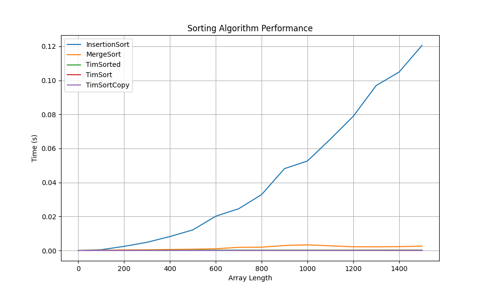

#### first
\
####
Now we can see than the ```MergeSort``` algorithm is quite fast (150_000 elements ~400msec). We can see that the time complexity looks like $O(n\cdot log(n))$.\
But it is still far slower than embedded algorithms used by Python (it is expected even because the embedded algorithms are implemented on C/C++ inside an interpreter).\
Let's go further and compare ```sort()``` and ```sorted()```.
#### second
\
####
last\
\
the end
